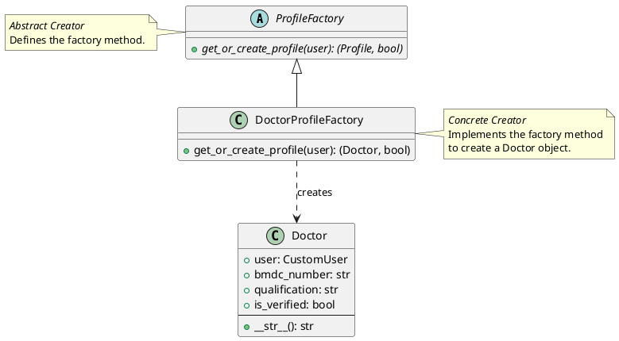
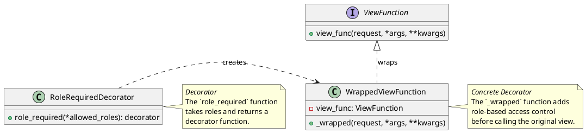

CSE 3216 - Software Design Patterns Lab
Project Report

# MediSched+: Online Healthcare Appointment Management System

<p align="center">
  <a href="https://medisched-5y1e.onrender.com/" target="_blank">
    
  </a>
  &nbsp;
  <a href="https://drive.google.com/file/d/11F2RGwGhlgrLPCdUoSuOsynVfDvypIaA/view?usp=drive_link" target="_blank">
    
  </a>
</p>

NOTE : Click the Link and wait Some times Render will Load Application.

**Project Name**
MediSched

Department of Computer Science & Engineering
University of Dhaka

**Team Member**
Abdullah Al Arman Emon (50),
Shah Jamal Islam (81),
Suhail Tanvir Nahin (82),
Md. Rakib Hossain (88)


***

## 1. Introduction

### 1.1 Problem Definition & Context

The project, **MediSched**, addresses the challenges in traditional healthcare appointment systems, which often suffer from long waiting times, geographical barriers, and inefficient communication between patients and doctors. The context is a modern, web-based platform designed to streamline the process of scheduling, managing, and conducting virtual medical consultations. It aims to provide a robust, multi-user environment for patients to connect with specialized doctors for both general and special consultations, complete with integrated payment and communication features.

### 1.2 Motivation

The primary motivation for developing MediSched was to apply software design patterns to create a highly **maintainable, scalable, and extensible** application. The goal was to move beyond simple CRUD (Create, Read, Update, Delete) operations and implement established architectural and object-oriented patterns to handle complex features like user role management, external API integration (for video calls), and object creation logic in a clean, decoupled manner. This ensures the system can easily adapt to new requirements, such as adding new user roles or integrating different communication platforms, without major refactoring.

### 1.3 Core Features

The MediSched system provides the following core functionalities:

1.  **Multi-Role Authentication**: Secure sign-up and sign-in for two primary user types: **Patient** and **Doctor**.
2.  **Doctor Profile Management**: Doctors can manage their qualifications, experience, working hours, and set different fee structures for general and special consultations.
3.  **Appointment Booking**: Patients can search for doctors based on specialization (Department/Symptom) and book scheduled or instant video consultations.
4.  **Integrated Payment**: A mechanism for calculating consultation fees, VAT, and platform fees, and tracking payment status and transactions.
5.  **Real-time Communication**: Integration with the **Agora API** for secure, real-time video and audio consultation sessions.
6.  **Role-Based Access Control (RBAC)**: Ensuring that only users with the correct role can access specific views and functionalities (e.g., only doctors can access the doctor dashboard).

### 1.4 Tools, Technologies & Frameworks Used

| Category | Tool/Technology | Rationale |
| :--- | :--- | :--- |
| **Backend Framework** | **Django 5.2.8** (Python) | Provides a robust Model-View-Template (MVT) architecture, built-in ORM, and administrative interface, promoting rapid development and clear separation of concerns. |
| **Database** | **SQLite** (Development) | Simple, file-based database used for development and testing, leveraging Django's ORM. |
| **Frontend** | HTML5, CSS3, JavaScript | Standard web technologies for user interface development, utilizing Django's templating engine. |
| **External API** | **Agora SDK** | Used for generating secure tokens for real-time video and audio communication, abstracting complex media server logic. |
| **Design Patterns** | Factory Method, Decorator, Facade/Adapter | Applied to manage object creation, enforce access control, and simplify external service integration. |


***

## 2. System Overview

### 2.1 System Architecture

MediSched follows the **Model-View-Template (MVT)** architectural pattern inherent to the Django framework, which is a variation of the classic Model-View-Controller (MVC).

| Component | Responsibility | Design Principle |
| :--- | :--- | :--- |
| **Model** | Defines the data structure, manages database interactions (ORM), and enforces business logic (e.g., `Appointment.save()` for fee calculation). | **Single Responsibility Principle (SRP)** |
| **View** | Contains the application logic, processes user requests, interacts with the Model, and selects the appropriate Template. | **Separation of Concerns** |
| **Template** | Handles the presentation layer (HTML/CSS/JS), rendering data provided by the View. | **Separation of Concerns** |

The system is further organized into modular Django applications:

*   **`users`**: Handles custom user model, authentication, and role management.
*   **`doctor`**: Manages doctor-specific profiles, experience, and specialization.
*   **`appointment`**: Core business logic for booking, payment, and transaction history.
*   **`communication`**: Manages video call token generation and chat functionality, acting as a **Facade** for the Agora API.
*   **`home`**: Public-facing pages and doctor search functionality.

### 2.2 Use Case Diagrams

The primary use cases for the MediSched system are centered around the two main actors: **Patient** and **Doctor**.

**Key Use Cases:**

1.  **User Authentication & Authorization**:
    *   **Sign Up**: Patient/Doctor registers and is assigned a role.
    *   **Sign In**: User logs in, and access is granted based on their role.
2.  **Appointment Management (Patient)**:
    *   **Search Doctor**: Search by department or symptom.
    *   **Book Appointment**: Select doctor, date, time, and consultation type (scheduled/instant).
    *   **Make Payment**: Complete the payment transaction.
    *   **Join Video Consultation**: Access the video call room.
3.  **Appointment Management (Doctor)**:
    *   **Manage Profile**: Update qualifications, experience, and fees.
    *   **View Appointments**: See a list of pending, confirmed, and completed appointments.
    *   **Join Video Consultation**: Access the video call room.
    *   **Mark as Complete**: Update appointment status and add notes.

***

## 3. Design Patterns Used

### 3.1 Design Philosophy & Rationale

The design philosophy of MediSched is rooted in **modularity** and **decoupling**. By applying design patterns, we aimed to isolate areas of change, making the system easier to test, debug, and extend. The MVT architecture already enforces a high degree of separation, but patterns were used to manage specific complexities: object creation (Factory), cross-cutting concerns (Decorator), and external dependencies (Facade/Adapter).

### 3.2 Factory Method Pattern

*   **Pattern Name**: Factory Method (Creational Pattern)
*   **Problem Addressed**: The system needs to create different types of user profiles (e.g., `Doctor`, `Patient`) based on the underlying `CustomUser` object, but the specific class to instantiate should be determined at runtime and decoupled from the client code.
*   **Why This Pattern?**: The Factory Method pattern provides an interface (`ProfileFactory`) for creating an object, but allows subclasses (`DoctorProfileFactory`) to alter the type of object that will be created. This adheres to the **Open/Closed Principle**, as adding a new profile type (e.g., `AdminProfile`) only requires creating a new concrete factory without modifying the existing client code that uses the abstract factory.

*   **UML Diagram (Source Code)**: The following PlantUML source code describes the implementation:



*   **Implementation Snippet** (`doctor/factories.py`):

```python
class ProfileFactory(ABC):
    @abstractmethod
    def get_or_create_profile(self, user):
        pass

class DoctorProfileFactory(ProfileFactory):
    def get_or_create_profile(self, user):
        # The 'product' is the Doctor object
        doctor, created = Doctor.objects.get_or_create(user=user)
        return doctor, created
```

*   **Benefits Achieved**: **Decoupling** of the profile creation logic from the user registration/login process. The system can easily support new user roles (e.g., Pharmacist) by simply adding a new concrete factory.
*   **Limitations & Trade-offs**: For a small system with only two roles, the overhead of the abstract class and concrete factory might seem excessive. However, this structure is a necessary investment for future scalability.

### 3.3 Decorator Pattern

*   **Pattern Name**: Decorator (Structural Pattern)
*   **Problem Addressed**: The need to dynamically add responsibilities (specifically, role-based access control) to a function (a Django view) without modifying its core structure.
*   **Why This Pattern?**: The Decorator pattern is naturally implemented in Python using function decorators (`@role_required`). It allows us to wrap a view function with logic that checks the user's role before executing the original view, enforcing the **Single Responsibility Principle** by separating the access control logic from the view's business logic.

*   **UML Diagram (Source Code)**: The following PlantUML source code describes the implementation:



*   **Implementation Snippet** (`users/decorators.py`):

```python
from django.core.exceptions import PermissionDenied
from functools import wraps

def role_required(*allowed_roles):
    def decorator(view_func):
        @wraps(view_func)
        def _wrapped(request, *args, **kwargs):
            if not request.user.is_authenticated:
                raise PermissionDenied
            if request.user.role not in allowed_roles:
                raise PermissionDenied
            return view_func(request, *args, **kwargs)
        return _wrapped
    return decorator
```

*   **Benefits Achieved**: **Clean, reusable access control**. Any view can be protected by simply adding `@role_required('doctor')` above the function definition, promoting code reusability and reducing boilerplate code in the views.
*   **Limitations & Trade-offs**: The use of decorators can sometimes obscure the control flow, making debugging slightly more complex if the decorator itself contains errors.

### 3.4 Facade/Adapter Pattern

*   **Pattern Name**: Facade/Adapter (Structural Pattern)
*   **Problem Addressed**: The complexity of integrating with the external **Agora API** for video call token generation. The client code (Django views) should not need to know the specific details of token building, expiration times, or API keys.
*   **Why This Pattern?**: The `communication/agora_utils.py` module acts as a **Facade** (or an Adapter) by providing a simplified, unified interface (`generate_rtc_token`, `generate_rtm_token`) to the complex subsystem of the Agora SDK.

*   **Implementation Snippet** (`communication/agora_utils.py`):

```python
# The Facade class
def generate_rtc_token(channel_name, uid, expire_time=3600):
    app_id = settings.AGORA_APP_ID
    certificate = settings.AGORA_APP_CERTIFICATE
    # ... (internal logic for token building)
    token = RtcTokenBuilder.buildTokenWithUid(
        app_id,
        certificate,
        channel_name,
        int(uid),
        role,
        expire_ts
    )
    return token
```

*   **Benefits Achieved**: **Decoupling from external API**. If the project needs to switch from Agora to a different video conferencing service (e.g., Twilio, Jitsi), only the `agora_utils.py` file needs to be modified, leaving all the client views untouched. This greatly enhances maintainability.
*   **Limitations & Trade-offs**: The Facade only exposes a subset of the external API's functionality. If a view needs a very specific, low-level feature of the Agora SDK, it might have to bypass the Facade, which breaks the pattern's intent.

***

## 4. System Implementation

### 4.1 UI Screens

The system provides distinct user interfaces tailored to the user's role:

*   **Sign-in/Sign-up Screen**: A unified entry point for both patients and doctors.
*   **Patient Dashboard**: Allows patients to view upcoming appointments, past consultations, and access the doctor search functionality.
*   **Doctor Dashboard**: Provides doctors with an overview of their schedule, appointment analytics, and links to manage their profile, fees, and experience.
*   **Appointment Booking Flow**: A multi-step process where the patient selects a doctor, chooses a time slot, and proceeds to the payment page.
*   **Video Consultation Screen**: A dedicated view for the real-time video call, integrated with the Agora token generation logic.

### 4.2 Code Modules & Responsibilities

The project is structured using the Django application model, ensuring high modularity:

| Module (App) | Primary Responsibility | Key Models |
| :--- | :--- | :--- |
| **`users`** | User authentication, authorization, and custom user model (`CustomUser`). | `CustomUser` |
| **`doctor`** | Doctor-specific profile management, specialization, and experience tracking. | `Doctor`, `DoctorExperience`, `DoctorAppointmentFee` |
| **`appointment`** | Core appointment scheduling, payment tracking, and history management. | `Appointment`, `PaymentTransaction`, `AppointmentRescheduleHistory` |
| **`communication`** | Real-time communication features, including Agora API integration for video calls. | (Utility functions and views) |
| **`adminapp`** | Management of static data like Departments, Symptoms, and geographical locations. | `Department`, `Symptom`, `Division`, `District` |
| **`home`** | Public-facing pages, doctor search, and general navigation. | (Views and Templates) |

### 4.3 File/Package Structure

The project follows a standard Django structure, nested within a top-level directory:

```
MediSched/
├── medisched/ (Project Root)
│   ├── medisched/ (Project Settings)
│   │   ├── settings.py
│   │   └── urls.py
│   ├── users/ (App)
│   │   ├── models.py (CustomUser, Decorator Pattern)
│   │   └── decorators.py (Decorator Pattern)
│   ├── doctor/ (App)
│   │   ├── models.py (Doctor Profile)
│   │   └── factories.py (Factory Method Pattern)
│   ├── appointment/ (App)
│   │   └── models.py (Appointment, PaymentTransaction)
│   ├── communication/ (App)
│   │   └── agora_utils.py (Facade/Adapter Pattern)
│   └── manage.py
└── requirements.txt
```

### 4.4 Database Schema

The core of the database schema revolves around the relationships between the `CustomUser`, `Doctor`, and `Appointment` models.

| Model | Key Fields | Relationships |
| :--- | :--- | :--- |
| **`CustomUser`** | `username`, `email`, `role` (patient/doctor), `phone` | One-to-One with `Doctor` (via `doctor_profile`) |
| **`Doctor`** | `user` (FK), `bmdc_number`, `qualification`, `rating` | Many-to-Many with `Department` and `Symptom` |
| **`DoctorAppointmentFee`** | `doctor` (FK), `category` (General/Special), `price` | Foreign Key to `Doctor` |
| **`Appointment`** | `patient` (FK), `doctor` (FK), `appointment_date`, `total_amount`, `status` | Foreign Key to `CustomUser` (patient) and `Doctor` |
| **`PaymentTransaction`** | `appointment` (One-to-One), `amount`, `status`, `transaction_id` | One-to-One with `Appointment` |


## 5. Evaluation

### 5.1 Evidence of Improvement

The application of design patterns, particularly the **Factory Method** and **Decorator**, provided tangible evidence of improved code quality:

*   **Reduced Conditional Logic**: The Factory Method eliminated the need for complex `if-elif-else` blocks in the user registration process to determine which profile to create. The logic is encapsulated within the factory, making the client code cleaner.
*   **Enforced Security**: The Decorator pattern ensures that access control is consistently applied across all protected views. This is a significant improvement over manually checking the user's role at the beginning of every view function, which is error-prone and violates the **Don't Repeat Yourself (DRY)** principle.

### 5.2 Comparison With Non-Pattern Alternative

| Feature | Pattern Used | Non-Pattern Alternative | Benefit of Pattern |
| :--- | :--- | :--- | :--- |
| **Profile Creation** | **Factory Method** | Direct instantiation (`if user.role == 'doctor': Doctor.objects.create(...)`) | **Extensibility**: Adding a new role (e.g., `Nurse`) requires only a new factory class, not modifying the central creation logic. |
| **Access Control** | **Decorator** | Copy-pasting role-check logic into every view function. | **Maintainability**: Centralized, reusable logic. A change to the access control mechanism is made in one place. |
| **API Integration** | **Facade/Adapter** | Calling the external SDK functions directly from the view. | **Decoupling**: The core application logic is shielded from changes in the external API's interface. |

### 5.3 Maintainability Assessment

The MediSched project scores highly on maintainability due to its adherence to the MVT architecture and the strategic use of design patterns:

*   **High Cohesion and Low Coupling**: Each Django app has a clear, single responsibility (e.g., `doctor` for doctor profiles, `appointment` for booking). The Factory and Facade patterns further reduce coupling between modules.
*   **Testability**: The decoupled nature of the code, especially the Factory and Facade, makes unit testing easier. For example, the `DoctorProfileFactory` can be tested in isolation without needing to test the entire user registration flow.
*   **Readability**: The use of Python decorators for access control makes the intent of each view function immediately clear to a developer.

***

## 6. Conclusion

### 6.1 Challenges & Solutions

| Challenge | Solution Implemented |
| :--- | :--- |
| **Role-Based Access Control** | Implemented the **Decorator Pattern** (`@role_required`) to wrap view functions, centralizing and simplifying authorization logic. |
| **External API Integration** | Implemented the **Facade/Adapter Pattern** (`agora_utils.py`) to abstract the complexity of the Agora SDK's token generation process. |
| **User Profile Creation** | Implemented the **Factory Method Pattern** to cleanly create different profile types (`Doctor`, `Patient`) based on the user's role. |

### 6.2 Lessons Learned

The project reinforced the critical lesson that design patterns are not merely academic concepts but practical tools for managing complexity. The most significant lesson was the power of **decoupling**—by separating the *what* (the product to be created) from the *how* (the creation logic) using the Factory Method, and separating the *core logic* from the *cross-cutting concerns* (access control) using the Decorator, the resulting codebase is significantly more robust and easier to evolve.

### 6.3 Future Improvements

1.  **Strategy Pattern for Payment**: Implement a Strategy pattern to handle different payment gateways (bKash, Nagad, Card) by defining a common payment interface and concrete strategy classes for each gateway.
2.  **Observer Pattern for Notifications**: Use Django Signals (an implementation of the Observer pattern) to automatically send email or SMS notifications to the patient and doctor upon appointment confirmation or cancellation.
3.  **Command Pattern for Admin Actions**: Encapsulate complex administrative actions (e.g., bulk data export, user verification) as Command objects to support undo/redo functionality and logging.

### 6.4 Reflection on Design Principles

The MediSched project successfully applied several core design principles:

*   **Single Responsibility Principle (SRP)**: Achieved by dividing the system into small, focused Django apps and by using the Decorator pattern to separate access control from business logic.
*   **Open/Closed Principle (OCP)**: Demonstrated by the Factory Method, which allows the system to be *open* for extension (new profile types) but *closed* for modification (existing creation logic remains untouched).
*   **Dependency Inversion Principle (DIP)**: Partially achieved by the Facade pattern, where the high-level view logic depends on the abstract interface provided by `agora_utils`, not the low-level details of the Agora SDK.

***

## Appendix

### A. UML Diagrams

The following sections contain the PlantUML source code used to generate the Class Diagrams for the implemented design patterns.

#### A.1 Factory Method Pattern Class Diagram Source


#### A.2 Decorator Pattern Class Diagram Source


### B. Glossary

| Term | Definition |
| :--- | :--- |
| **MVT** | **Model-View-Template**. The architectural pattern used by the Django framework, separating data (Model), business logic (View), and presentation (Template). |
| **ORM** | **Object-Relational Mapper**. A technique that lets developers query and manipulate data from a database using an object-oriented paradigm (used by Django). |
| **SRP** | **Single Responsibility Principle**. A design principle that states that every module, class, or function should have responsibility over a single part of the functionality. |
| **RBAC** | **Role-Based Access Control**. An approach to restricting system access to authorized users based on their role within the organization. |
| **Agora SDK** | A software development kit used for integrating real-time voice, video, and live streaming capabilities into applications. |

### C. References

[1] Django Documentation. (n.d.). *The Django web framework*. Retrieved from https://docs.djangoproject.com/
[2] Gamma, E., Helm, R., Johnson, R., & Vlissides, J. (1994). *Design Patterns: Elements of Reusable Object-Oriented Software*. Addison-Wesley.
[3] Python Software Foundation. (n.d.). *The Python programming language*. Retrieved from https://www.python.org/
[4] Agora. (n.d.). *Agora Developer Documentation*. Retrieved from https://docs.agora.io/
